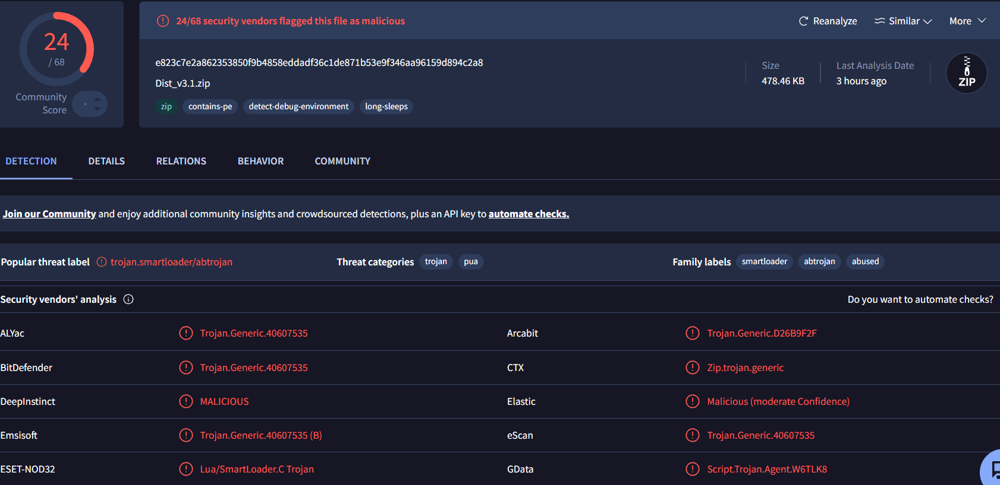
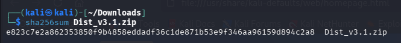
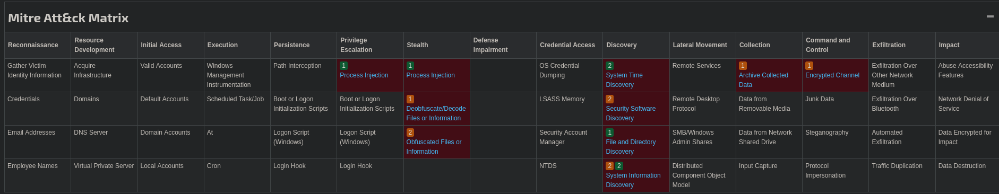

# Threat Intelligence Report: Fake FiveM Executor Malware Campaign

| | |
|---|---|
| **Analysis Date** | October 2026 |
| **Threat Type** | Malware Dropper / Infostealer via GitHub Pages |
| **Severity Level** | High |
| **Platform** | Windows (Win32) |

---

## 1. Overview

Discovery and tracking of a malicious campaign mimicking a fake download landing page for a **"FiveM Executor Lua"** tool.

The repository utilizes an **AI-generated README** featuring eye-catching emojis and social engineering instructions tricking users into **disabling Windows security protections** to execute the payload.

---

## 2. Infrastructure & Suspicious Links

> 
> Figure 1: VirusTotal analysis of `Dist_v3.1.zip` showing 24/68 security vendor detections (SmartLoader / Trojan).

---

## 3. Kali Linux Investigation & Extraction

> 
> Figure 2: Verification of the SHA-256 hash using `sha256sum` in the Kali Linux environment.

## 3. Kali Linux Investigation & Extraction

After pulling the sample into a Kali Linux environment, the archive was extracted (unencrypted) using the command:

```bash
unzip Dist_v3.1.zip
```

The resulting SHA-256 hash of the ZIP file is:

```text
e823c7e2a862353850f9b4858eddadf36c1de871b53e9f346aa96159d894c2a8
```

---

## 4. Bundled Files & Indicators of Compromise (IoCs)

The extracted archive contains **three main files**:

| File | Type | SHA-256 | Size |
|---|---|---|---|
| `cli.exe` | Win32 Executable — **flagged as malicious** | `c434ce8620057d9dd9073b4af8382bf27e85729d152164909f1052775e7ddc70` | 742.50 KB |
| `pkey.txt` | Text file containing obfuscated code | `e191ca1764270ad8272eceee93eddd18fd6a3cbbdbfbd01b827b303ffbfd7f41` | 194.90 KB |
| `Application.cmd` | Batch launch script | `41513c7080051d8062547008e1a9ece72fe3f1cbb00545bd06d91f1d136d3d6b` | — |

### 4.1 `pkey.txt` — Obfuscated Code Snippet

```lua
local hz=function(t)local L,Q=t[#t],""for H=1,#L,1 do Q=Q..L[t[H]]end return Q end
local lz=function(t)local L,Q=t[#t],""for H=1,#L,1 do Q=Q..L[t[H]]end return Q end
local pz={lz({3;2;1;{"\072\052\106\061\061","\099\116\115\086\112";"\098\069\115\055\086\055"}});...}
```

### 4.2 `Application.cmd` — Exact Content

```batch
start cli.exe pkey.txt
```

*Figure 2: Inspection of the extracted contents on Kali Linux.*

---

## 5. Network Activity & C2 Communications

Dynamic analysis revealed distinct callbacks and external connections:

**Contacted C2 URL:**

```text
http://185.10.68.110/api/NTE3YjdjNWU1NjYzNjU2YTA1N2Y=
```

**Third-Party Services / External Domains:**

- `ip-api.com`
- `polygon.drpc.org`
- `assets.msn.com`

*Figure 3: VirusTotal network graph showing contacted C2 infrastructure and domains.*

---

## 6. Campaign Scope & Threat Attribution (Parent Archives)
Further intelligence correlation on the `cli.exe` executable reveals it acts as a recurring payload across multiple distinct malicious archives on GitHub, targeting various gaming communities through fake cheats, trainers, and mods:
* `pacifistic.zip`
* `O-Overwatch-ES-Hack-Aimbot-v3.9-alpha.4.zip`
* `tarkov_item_dupe_v3.4.zip`
* `Application_v1.3.zip`

This indicates an automated distribution pipeline or a "malware-as-a-service" campaign template deployed across multiple repositories to harvest user credentials and system data.

## 7. Technical Analysis & MITRE ATT&CK Mapping

### Binary Profile (`zen.exe` / `cli.exe`)
* **SHA-256:** `c434ce8620057d9dd9073b4af8382bf27e85729d152164909f1052775e7ddc70`
* **Compilation Date:** April 29, 2026
* **Runtime Environment:** Embedded LuaJIT 2.1 (`LuaJIT 2.1.1763668258 -- Copyright (C) 2005-2025 Mike Pall`), acting as a custom interpreter to execute the obfuscated scripts.
* **Process Execution:** Runs with elevated/administrator privileges, spawning `conhost.exe` to manage the console session.

### MITRE ATT&CK Tactics & Techniques
* **Execution:** Command and Scripting Interpreter (T1059) – Leveraging an embedded LuaJIT runtime to execute bundled obfuscated logic.
* **Defense Evasion:** Obfuscated Files or Information (T1027) – Heavy reliance on custom string decoding functions and ASCII character mapping within `pkey.txt`.
* **Discovery:** System Information Discovery (T1082) & System Time Discovery (T1124).
* **Collection:** Archive Collected Data (T1560) – Staging local files before potential data exfiltration.

> 
> Figure 4: Threat behavior mapped against the MITRE ATT&CK framework.

## Appendix: IOC Summary

| Indicator | Type | Context |
|---|---|---|
| `Keen-arere8666/keen-arere8666.github.io` | GitHub Pages repository | Fake FiveM Executor landing page |
| `.../wp-content/plugins/woocommerce/assets/css/photoswipe/default-skin/Dist_v3.1.zip` | Payload URL | Hidden in fake WordPress plugin path |
| `e823c7e2a862353850f9b4858eddadf36c1de871b53e9f346aa96159d894c2a8` | SHA-256 (ZIP) | Dropper archive |
| `c434ce8620057d9dd9073b4af8382bf27e85729d152164909f1052775e7ddc70` | SHA-256 (PE) | `cli.exe` — malicious Win32 executable |
| `e191ca1764270ad8272eceee93eddd18fd6a3cbbdbfbd01b827b303ffbfd7f41` | SHA-256 | `pkey.txt` — obfuscated payload code |
| `41513c7080051d8062547008e1a9ece72fe3f1cbb00545bd06d91f1d136d3d6b` | SHA-256 | `Application.cmd` — batch launcher |
| `185.10.68.110` | IPv4 (C2) | `/api/NTE3YjdjNWU1NjYzNjU2YTA1N2Y=` callback endpoint |
| `ip-api.com` | Domain | Third-party service |
| `polygon.drpc.org` | Domain | Third-party service |
| `assets.msn.com` | Domain | Third-party service |
